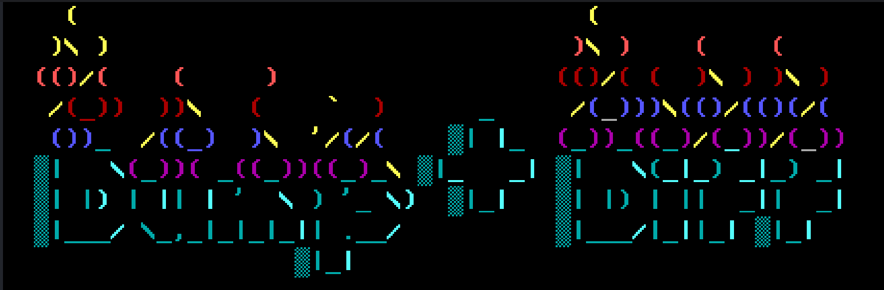
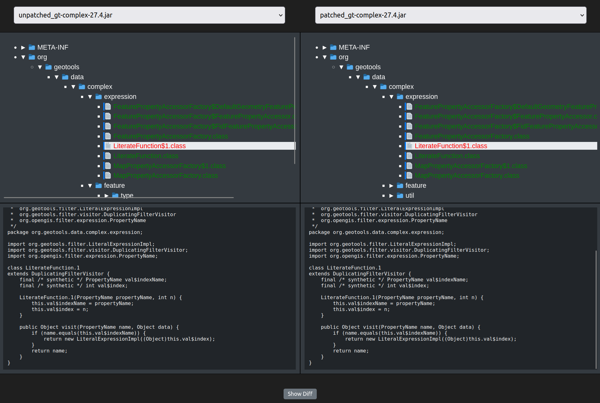
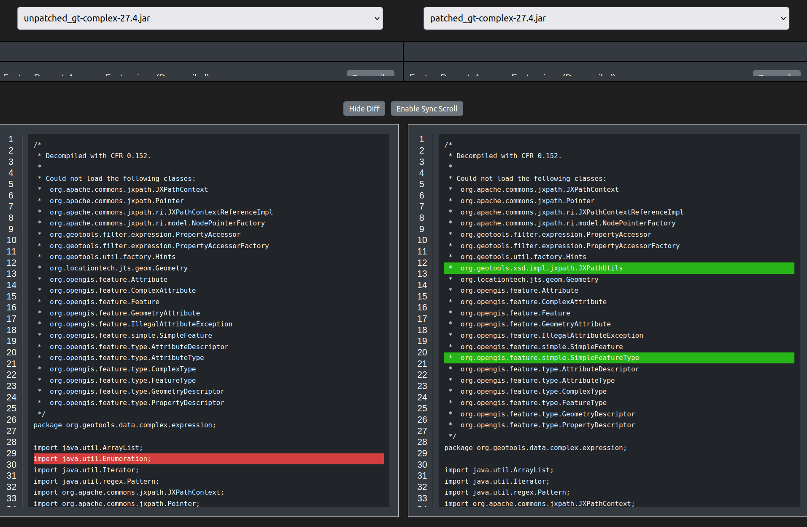

# Dump & Diff


## Setup

### Download CFR decompiler tool
Available [here](https://github.com/leibnitz27/cfr/releases/download/0.152/cfr-0.152.jar), this file should be placed in the root of the repository. It is required by the backend to perform decompilation in the container.

### Initialize project
There must be a project directory created under `java-decompiler-backend/workdir` and any JAR files to be analyzed should be placed within.

For example:

```
export PROJ=geoserver
mkdir java-decompiler-backend/workdir/$PROJ
cp /path/to/jar/files/*.jar java-decompiler-backend/workdir/$PROJ
```

## Build images
`docker-compose build`


## Start services
`docker-compose up`


## Use
Visit `http://localhost:8080` in a web browser to use the tool. 

## Gallery
 


